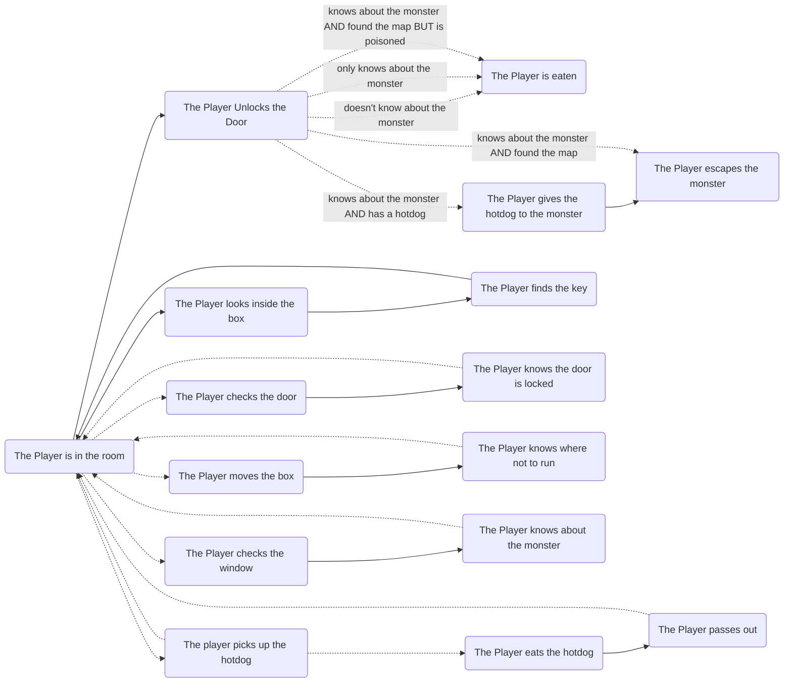

# "What?" or Project Goals

- ["What?" or Project Goals](#what-or-project-goals)
  - [Primary Goal](#primary-goal)
  - [Secondary Goals](#secondary-goals)
  - [Also Considering, But Not That Important, Really](#also-considering-but-not-that-important-really)
- [About The Very Special Markup](#about-the-very-special-markup)
  - [Making Marks](#making-marks)
  - [Taking Names](#taking-names)
  - [Going Places](#going-places)
    - [Going Nowhere](#going-nowhere)
    - [Verbs](#verbs)
- [A More Analog Approach To Tracking Variables](#a-more-analog-approach-to-tracking-variables)
  - [We Do It Old-School — By Including it All](#we-do-it-old-school--by-including-it-all)
  - [Choices That Depend on Whether You Have Something](#choices-that-depend-on-whether-you-have-something)
- [Rough Journey from `story.svsm` to `story.pdf`](#rough-journey-from-storysvsm-to-storypdf)
- [Miscellaneous Thoughts](#miscellaneous-thoughts)
  - [Don't Allow Access to Choices Based on Information We Can't Get To](#dont-allow-access-to-choices-based-on-information-we-cant-get-to)
  - [Visualising the Story Graph](#visualising-the-story-graph)
  - [Generating a Character Sheet](#generating-a-character-sheet)
  - [Cross File Linking](#cross-file-linking)
  - [Endless Loops](#endless-loops)
  - [PDF Customisation](#pdf-customisation)
    - [Image Placement](#image-placement)
    - [Where Do Sections Start?](#where-do-sections-start)

## Primary Goal

Feed the parser / interpreter / machine some very special markup and, eventually, get a PDF out. This PDF can be read anywhere a PDF can be read.

The PDF will display links to story chunks in a format recognisable from the classical Choose Your Own Adventure books — namely, they will express choices as

> If `[ CHOICE ]`, turn to page `[ PAGE NUMBER ]`

In an electronic PDF reader, these links will be clickable anyway.

In a physical form (i.e. the author prints out the generated PDF), these page numbers are canonical in the document — e.g. a choice that indicates the reader should turn to page 10 will actually point to page 10 in the document, and that 10th page will be the proper continuation of the story.

## Secondary Goals

- The machine will tell you if there are any unfinished story branches.
- The PDF will use a more analog approach to tracking variables and managing events (this is [detailed below](#a-more-analog-approach-to-tracking-variables))
  - Lots and lots of pages
  - Support for split volumes
  - Character sheet
- PDF customisation (probably through LaTeX templates passed to pandoc)
- Syntax definitions?

## Also Considering, But Not That Important, Really

- Export to JS / web
- Inclusion of images
- Own IDE for Storious projects / VSCode plugin lol

# About The Very Special Markup

It's plain text, so a sufficiently savvy author (i.e. one that can open a file) should have no issues reading and writing a Storious file (plot issues and creative block notwithstanding).

The machine will accept `.md` and `.svsm` files (`svsm` just being a renamed markdown file, stands for `Storious' Very Special Markup`).

## Making Marks

A chunk more or less looks like this:

```markdown
---
name: Chunk Name
---

This is the chunk text. You know, the part you actually read when you do a read-through of a Choose Your Own Adventure book.

# Yep! This is a heading.

You can do whatever you'd like in here, really.

- List
- some
- things

`preformatted text`

think:[["Well, that was nice."]]
```

This chunk would produce the following page:

```
This is the chunk text. You know, the part you actually read when you do a read-through of a Choose Your Own Adventure book.

Yep! This is a heading.

You can do whatever you'd like in here, really.

- List
- some
- things

preformatted text

If you think "Well, that was nice.", turn to page 2.

```

## Taking Names

The chunks of story text that you read are called **chunks**. Chunks are self-contained pieces of text that contain zero or more _links_ to other chunks. Storious is best written with chunks that live in their own text files, but if an author prefers to have larger files that contain more than one chunk, that's legal too.

Every chunk must have its own unique title, and they cannot link to themselves. Other than that, go nuts.

## Going Places

The meat and bones of a Choose Your Own Adventure work. The links are inspired by wikilinks, or the Zettelkästen method.

For example, having a chunk that reads like so:

```
"Wow," said the crocodile man. "That's wild."

It's awkward. You don't know each other too well.

say:[[youre wild|"You're wild!"]]
say:[["Nah. Just a regular Tuesday."]]
```

would produce:

```
"Wow," said the crocodile man. "That's wild."

It's awkward. You don't know each other too well.

If you say "You're wild!", turn to page 24.
If you say "Nah. Just a regular Tuesday.", turn to page 35.
```

The first link would look for a chunk that is called `youre wild` (space inclusive: `youre-wild` would be a different chunk, which would not be interchangeable), and the second would look for a chunk named `Nah Just a regular Tuesday` (not interchangeable with `nah just a regular tuesday`).

Links can be masked, like in the case of `youre wild`, where

> If you say youre wild, turn to page 24.

would not be a good look. The format of a marked link is `[[ DESTINATION | MASK ]]`.

### Going Nowhere

Links that go to chunks that do not exist will not cause compilation of the PDF to fail.

Instead, the compiler will print a warning, and a short snippet will be printed at the destination, something like

```
This page intentionally left blank.

Did you mean to have something here? Check that your chunks are named right and
that your links point to them. Remember, links are case and space sensitive!

PDF generated by Storious X.X.XXX
```

### Verbs

In that example, both links were prefixed with the `say:` directive. This means that the string `say` was swapped into the

> If you `[ VERB DIRECTIVE ]` `[ LINK MASK OR CONTENTS ]`, turn to `[ PAGE NUMBER ]`

template.

This is case sensitive: the directive `Houndcall:[[for some help]]` would produce

> If you Houndcall for some help, turn to page 60.

Attempting to use multiple verbs / a sentence fragment like `furiously cry:[["You killed my father!"]]` will not work:

> furiously
>
> If you cry "You killed my father!", turn to page 73.

Surround them with `(`parentheses`)` like so: `(squawk indignantly that):[["She had nothing to do with this!"]]`

> If you squawk indignantly that "She had nothing to do with this!", turn to page 11.

Just keep in mind what the template actually produces. Passing in `(squawk indignantly)` would have resulted in

> If you squawk indignantly "She had nothing to do with this!", turn to page 11.

which is not entirely grammatically correct.

Storious doesn't do grammar checking: that's for the authors, who really should be reading their Noninteractive Interactive Fictions to test them.

# A More Analog Approach To Tracking Variables

Consider the following pseudostory:

```
The Player is in a room. The door is locked. There is a mattress on the floor,
a window, a box and a hotdog on the plate.

The Player looks outside the window. They see a monster.

The Player tries the door. It's locked. Hmm...

The Player checks the box. There's a key inside!

The Player uses the key to unlock the door. They try to sneak away, but the
monster sees movement and chases them. The Player takes a wrong turn and ends
up at a dead end and is eaten to death.

THE END.
```

Pretty straightforward, right?

Well, not really. There are a few ways that could have gone.

**The Window** — in this read through, The Player only knew about the monster (and therefore that they had to sneak past) because they looked out of the window. What if they didn't, and when they had unlocked their door, had been surprised?

**The Box** — if the Player had moved the box, they might have found it was hiding an old, worn out map carved into the wall. They then would have known not to take that wrong turn.

**The Hot Dog** — the Player could have eaten the hot dog and found that it wasn't in the best condition. They could have passed out on the mattress and woken up at nighttime and had to have dealt with food poisoning.

Therefore, the tiny pseudostory actually flows like this:



The amount of fiction in a piece of interactive fiction quickly balloons: a scenario that was described start-to-finish in less than 100 words quickly becomes a tangled mess of "what-ifs" and "if-thens". This is, after all, why the medium works so well: there's someone or something else managing all the moving parts of a scene.

## We Do It Old-School — By Including it All

What's a book to do? There's no brain to drive dynamic choices, or keep track of counters or Boolean values. All we have are pages. Lots and lots of pages.

So that's what Storious uses: lots and lots of pages.

Assuming the author writes text to cover these eventualities, Storious will generate a PDF with page references that can be arbitrarily large. (Seeing `turn to page 2883` on page 1 would be _unexpected,_ to say the least)

Planned but not critical is the feature to split stories up across volumes. Amazon won't print your 9000 page magnum opus, but they will let you offer readers / your future self those 9000 words in 11ish 828-page instalments, for example.

Also to be determined is the order in which these chunks will be included.

## Choices That Depend on Whether You Have Something

As we saw in our tiny pseudostory, things quickly got unruly. The 'good' ending depended on a number of factors, and made use of a loop, too.

How Storious handles that needs a bit more thought. We can track character stats / inventory with a character sheet, I guess... and put in directives such as

> If you have more than $5, you may spend $5 to buy a box of cookies.
>
> Deduct $5 from your wallet and turn to page 29.

> If you do not buy anything, turn to page 50.

in the text.

The author just has to trust the reader not to cheat (and cheating is half the fun of a choose your own adventure book anyway).

# Rough Journey from `story.svsm` to `story.pdf`

Without having written a single line of code, here's the plan:

1. author creates `story.svsm`
2. run `storious story.svsm`
   1. scans for includes
   2. parses links to sections
   3. checks for unterminated branches, warns
   4. checks for endless loops, warns
   5. checks for unused files, warns
   6. cats files together
   7. invokes pandoc
3. get PDF

# Miscellaneous Thoughts

## Don't Allow Access to Choices Based on Information We Can't Get To

This is more of a continuity thing, but if there's a choice based on whether we've e.g. been `hauntedByGhost`, but we've so far never even encountered a ghost, what do we do?

As we do leverage markdown+yaml type files, we can declare variables and have Storious scan to see if `hauntedByGhost` ever changes to `true` in a branch or something?

This could lead to a lot of duplication, though. If a page has 4 choices, and two of those dis/appear based on variables, that's 4 occurances of a basically duplicated chunk with choices that look like

- a/b
- a/b/c
- a/b/d
- a/b/c/d

which could be hugely wasteful to print.

## Visualising the Story Graph

I mainly want this for me, because I love graphs :D

## Generating a Character Sheet

There could be a way to denote values that need to be tracked, like "mystical artifacts recovered" or "money in wallet" or something.

Storious could generate a template character sheet that a reader could use.

It could also be a tiny website, but that's a looooong way off just yet.

## Cross File Linking

This requires more research and will probably be changed once I work out the syntax a little more, but there's no reason Storious can't `cat` all the input files together. Probably means that files need to be explicitly included…

## Endless Loops

Loops can be an interesting writing device.

But an endless loop in a Choose Your Own Adventure book could lead to confusion (is this right? Did the author mess up?). To this end, Storious will print a warning if it finds endless loops in the story graph. It's up to the author on whether they want to keep the endless loop in their work, or provide an exit point.

## PDF Customisation

Yeah, the nice thing about pandoc is that you can just slide in a custom template and get something nice. Managing pandoc templates is out of scope for Storious, but maybe we could ship with one?

### Image Placement

There'll have to be some way of delimiting where an image goes. Inline? Float left/centre/right? On its own page? etc

### Where Do Sections Start?

In a regular book, parts and chapters begin on the right side – the preceding part or chapter either ends on the left page or there's a blank page between the two parts or chapters. More research is needed on whether every section of a Choose Your Own Adventure book only starts on the right.
